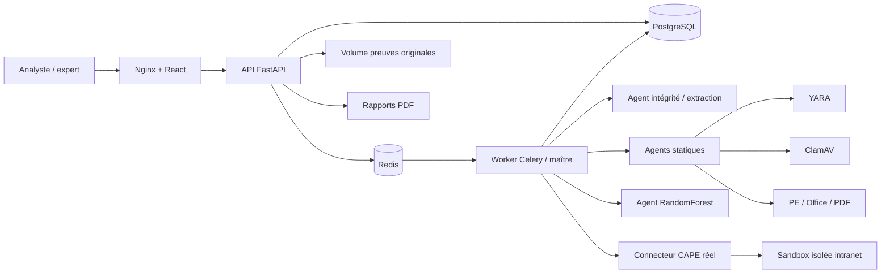
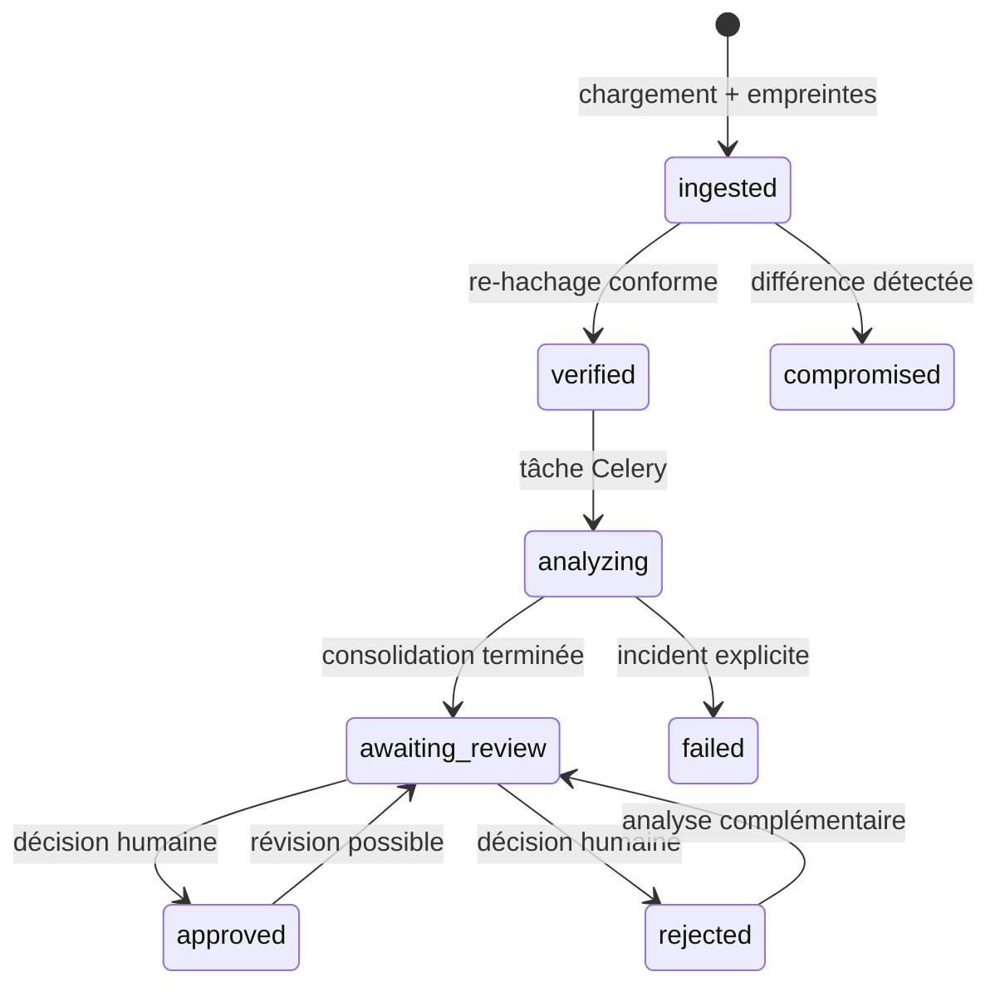

# Architecture MICEPP Scanner

## Vue d’ensemble

## Réseaux et persistance

- `backend` est un réseau Docker interne : base, Redis, API, worker et ClamAV y communiquent sans publication de ports.
- `frontend` relie le proxy à l’API ; seul nginx publie le port configuré.
- `updates` donne uniquement à ClamAV une sortie pour les signatures.
- `evidence` contient les originaux ; `work` les copies d’analyse ; `reports` les PDF ; `models` les versions IA.
- PostgreSQL conserve les métadonnées, décisions et événements d’audit. Redis transporte seulement les tâches.

## Chaîne de traitement

Le worker recalcule les quatre valeurs d’intégrité (taille, SHA-256, SHA-1, MD5) avant toute extraction. Une divergence est persistée comme incident critique avant l’arrêt de la tâche. Les archives sont protégées contre la traversée de chemin et les volumes d’extraction sont plafonnés.

## Consolidation et apprentissage

Les analyseurs rendent un score, une confiance, une catégorie, une description et des détails techniques. Le maître ne remplace jamais un résultat absent. `analysis_complete=false` est utilisé lorsque la couverture requise n’est pas disponible.

Le modèle n’est pas livré pré-entraîné sur de fausses données. Les vecteurs sont produits lors des analyses réelles, puis un reviewer attribue la vérité terrain. L’entraînement vérifie le nombre minimal par classe, sépare entraînement/test de façon stratifiée, enregistre métriques, noms de caractéristiques et empreinte du manifeste, puis active atomiquement la nouvelle version.

## Audit et chaîne de garde

Chaque action sensible ajoute un événement contenant l’acteur, la cible, l’horodatage, la charge utile et le hash précédent. Le hash de l’événement est un HMAC-SHA-256 utilisant une clé distincte du JWT. Un verrou transactionnel PostgreSQL sérialise les écritures concurrentes, empêchant une bifurcation de chaîne. L’endpoint `/api/v1/audit/verify` recalcule toute la chaîne.

## Points d’extension

- ajouter des fichiers `.yar` dans `backend/rules/` ;
- ajouter un analyseur sous `backend/app/analyzers/` et normaliser ses résultats avec `AnalyzerFinding` ;
- adapter `cape.py` si une version CAPE interne expose un chemin d’API personnalisé ;
- externaliser les volumes vers un stockage bloc chiffré, en conservant les chemins de montage attendus.

